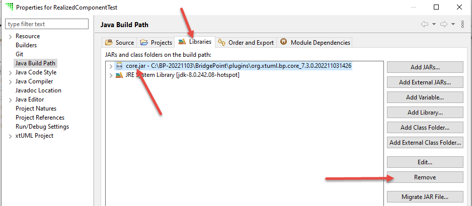
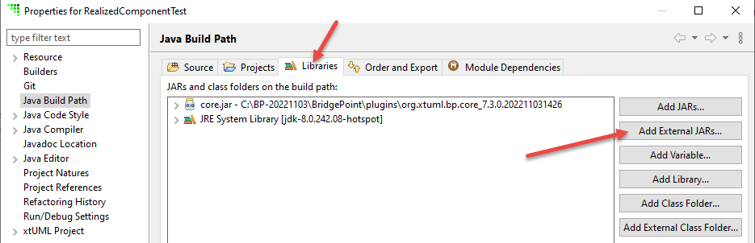
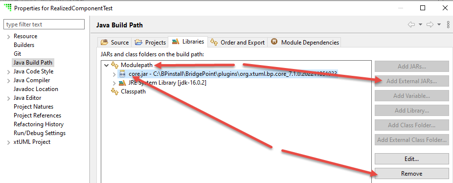

# RealizedComponent
Connect a component realized in Java to one modeled in xtUML for execution in BridgePoint Verifier.

## Prepare a Workspace
1. Create an xtUML project named BuiltInEEs.
2. Add a package named EEs to the BuiltInEEs project.
3. Select the EEs folder and select the context menu entry (right-click) for "Add Built-in External Entities".
4. Import the RealizedComponentTest project from this repository into the workspace.

## Project Overview
The project contains three components:
  - App: A very simple xtUML modeled component.
  - Device:  A very simple realized component.
  - Device_xtUML:  A modeled proxy for the realized component.
There are also two system configurations:
  - System_realized:  The App component connected to the realized Device component.
  - System_xtUML:  The app component connected to the modeled proxy Device_xtUML component.

The latter configuration is used for testing the interface protocol before complicating matters by
connecting the component realized in Java to the modeled component.  When building your system, use
a fully modeled configuration like this one to debug the modeled portion of the application and the 
communication protocol between it and the realized portion.  Then, move on to connecting the 
realized component to the modeled one.

The Interfaces package contains a single interface definition which formalizes the ports sprouted
from the components.

The /javasrc/components/ directory contains the Device component realized as a Java class 
called Device.

The /javasrc/interfaces/ directory contains Java interfaces representing the xtUML interface
called Device.  There is one Java interface for messages flowing from the modeled App component 
to the realized Device component and one for messages flowing in the opposite direction.

## Build the Project
The realized Device component must be compiled so that the Java class loader can 
locate and load the resulting class file when a Verifier session is started.  Since the
realized Device component depends on an external library that is part of the BridgePoint
installation, this library must first be added to the Java build path.

### Remove Existing core.jar from Java Build Path
But, before adding the library from your BridgePoint installation, the existing one, if it
exists, must be removed from the build path.

From within Project Explorer, select the RealizedComponentTest project and execute
"Build Path > Configure Build Path..."

Then, do the following:
  - select the Libraries tab
  - select core.jar in the list of JARs and class folders
  - poke the "Remove" button

### Add External Library to Java Build Path
From within Project Explorer, select the RealizedComponentTest project and execute
"Build Path > Configure Build Path..."

Then, do the following:
  - select the Libraries tab
  - poke the "Add External JARs" button
  - navigate to the org.xtuml.bp.core_\<version\>/core.jar file within your BridgePoint installation

Your build path view may be sub-divided into sections as shown in the image below.  If so,
delete the core.jar library from the Modulepath, and then add the core.jar library for 
your BridgePoint installation into the Modulepath.

### Build
From within Project Explorer, execute "Build Project" against the RealizedComponentTest project.  
Ensure there are no errors by checking the Problems view.

## Execute Realized Component in Verifier
1. Create a debug configuration using the System_realized configuration.
   - uncheck "Run deterministically"
   - uncheck "Enable simulated time"
2. Launch a Verifier session with this configuration.
3. In Session Explorer
   - Expand App/Classes
   - Expand App/Functions
4. Execute the `SendQuery()` function
5. Notice that an instance of DeviceReport is created
   - Expand the instance and inspect the attribute values
